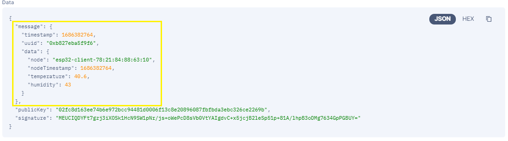

<!-- Title -->
<span align = "center">

# IOTA Raspberry Pi Gateway

Simplify the way to upload to IOTA Tangle via MQTT. 

</span>
<!-- End of Title -->

<br>
<span align = "center">
   


</span>
<br>


This method used to simplify other IoT node such as ESP8266 and ESP32 or the others. Just send to this gateway via MQTT and... voila... it is on Tangle.
As default, this code work on `Chrysalis Devnet`. If you want to use in production, please install hornet or collaborate with someone who has a hornet API to Chrysalis Mainnet.

## Prequerities
- Python 3.x
- pip

## Install Required Dependency

- Install Mosquitto
```
sudo apt-get install mosquitto
sudo apt-get install mosquitto-clients
```
- Install Paho MQTT
```
pip install paho-mqtt
```

Since newer mosquitto didn't support anonymous message, you need to allow it manually.
```
sudo nano /etc/mosquitto/mosquitto.conf
```
and add this lines
```
listener 1883
allow_anonymous true
```
- Digital Signature
```
pip install starkbank-ecdsa
```
## Turn Off Retained Message
When start subscribing MQTT topic, it will fetch latest message in topic. This is called retained message. If retained message is on, gateway will create new IOTA submission every time gateway is started. This will create duplicate data. To prevent gateway from this action, please follow steps below.

- Open terminal and type
```
sudo nano /etc/mosquitto/mosquitto.conf
```
- Change value of `persistance` from true to false
```
persistence false
```
- Stop mosquitto and start again
```
sudo service mosquitto stop
sudo service mosquitto start
```

## Running on Your Raspberry Pi
- Open terminal and 
```
git clone https://github.com/SuryaAssistant/iota-raspberrypi-gateway
```
- Go to `src` folder and run the program
```
cd iota-raspberrypi-gateway/src
python3 main.py
```

When you start the program from terminal, it will show you a `gateway id`.

- You need to subscribe MQTT topic to receive response from the gateway (Optional)
  
  - On linux or Windows
    - Syntax
    ```
    mosquitto_sub -h test.mosquitto.org -t "<your_gateway_id>/<your_return_topic>"
    ```
    - Example :
    ```
    mosquitto_sub -h test.mosquitto.org -t "0xb827eba5f9f6/myTopic"
    ```
  
- For upload process, run the step below
  - On Linux or Windows
    - Syntax
    ```
    mosquitto_pub -h test.mosquitto.org -t "0xb827eba5f9f6/submit" -m "data/{<your_data>}/<your_return_topic>"
    ```
    - Example :
    It is real **warning**, don't use `"` for json format, use `'` instead.
    ```
    mosquitto_pub -h test.mosquitto.org -t "0xb827eba5f9f6/submit" -m "data/{'node':'node1','encrypt_data':'xasdjkafadhdioasid1'}/mytopic"
    ```

  - On ESP based microcontroller, the topic to publish is `0xb827eba5f9f6/submit` and message format used is `data/{<your_data>}/<your_return_topic>`.

Other features are following [MQTT Message Syntax section](https://github.com/SuryaAssistant/iota-raspberrypi-gateway/tree/develop#mqtt-message-syntax).


## MQTT Message Syntax
|Feature|Syntax|Example|
|---|---|---|
| Upload data to IOTA Tangle | `data/{<your_data>}/<your_return_topic>`| `mosquitto_pub -h test.mosquitto.org -t "0xb827eba5f9f6/submit" -m "data/{"data":12}/myTopic"` |
| Get list of message ID in IOTA Tangle Index | `tag/<your_tag>/<your_return_topic>` | `mosquitto_pub -h test.mosquitto.org -t "0xb827eba5f9f6/submit" -m "tag/0xb827eba5f9f6/myTopic"` |
| Get full data of message (include indexation, milestone, etc) | `msg_data/<your_msg_id>/<your_return_topic>` |  |
| Get full metadata of message | `msg_metadata/<your_msg_id>/<your_return_topic>` |  |
| Get data of message (message, signature and uploader public key) | `payload/<your_msg_id>/<your_return_topic>` |  |
| Get data of message (only message that published via the gateway itself. If not from the gateway, it will return `Not Valid`) | `payload_valid/your_msg_id/<your_return_topic>` |  |


## Digital Signature for Data Integrity
This project used `secp256k1` elliptic curve to generate private key and public key. We are using python [starkbank-ecdsa](https://github.com/starkbank/ecdsa-python) library to generate and validate digital signature for the data. When you run the main.py for the first time, it will generate private key automatically and store the private key. As long as not re-installed, private key will still remain there.



The data that signatured is in yellow box. The result is in base64 format signature.
Format to validate the signature is defined below

**Data** : `"message":{"timestamp":1686382764,"uuid":"0xb827eba5f9f6","data":{"node":"esp32-client-78:21:84:88:63:10","nodeTimestamp":1686382764,"temperature":40.60,"humidity":43.00}}`
<br>
Data is **without** whitespace


**Public Key (compressed)** : `02fc8d163ee74b6e972bcc94481d0006f13c8e20896087fbfbda3ebc326ce2269b`

**Public Key PEM Format** :
```
-----BEGIN PUBLIC KEY-----
MFYwEAYHKoZIzj0CAQYFK4EEAAoDQgAE/I0WPudLbpcrzJRIHQAG8TyOIIlgh/v7
2j68MmziJpt+3/KrkvZ8CecdV53OXlOLNBRfU7ZtKbRSLOZQPAsBoA==
-----END PUBLIC KEY-----
```

**Signature (base64)** : `MEUCIQDYFt7gzj3iXOSk1HcN9SW1pNr/js+oWePcD8sVb0VtYAIgdvC+x5jcjB2leSp51p+81A/lhpB3oDMg7634GpPGBUY=`

For prooving, you can go [here](https://8gwifi.org/ecsignverify.jsp)

## Production
When you want to use this code in production, please modify the configuration in `config/config.py`.
- MQTT Broker

  Since this example using free to use MQTT Broker that have some limitations, please change `config.py`
  ```
  mqtt_addr = "<your_premium_broker>"
  ```
    
- IOTA Hornet Node
  Change url from chrysalis devnet to hornet url that connect to mainnet in `config.py`
  ```
  chrysalis_url = "<your_mainnet_hornet_address>"
  ```

